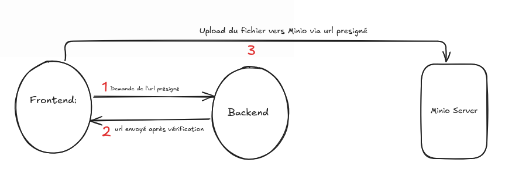
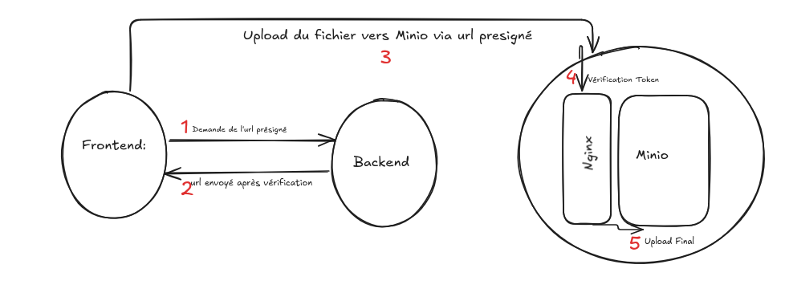

**Documentation officielle du SDK utilisé** : https://docs.aws.amazon.com/AWSJavaScriptSDK/v3/latest/client/s3/
# Introduction

## Qu'est-ce que MinIO ?
MinIO est une solution de stockage d'objets haute performance, compatible avec l'API S3 d'AWS. Il est conçu pour être léger, scalable et facile à déployer sur des infrastructures locales ou cloud. MinIO est souvent utilisé comme alternative à AWS S3 pour les environnements nécessitant une gestion privée des données.

## Avantages de MinIO
- **Open-source et auto-hébergé** : Permet un contrôle total des données sans dépendre d'un fournisseur cloud externe.
- **Compatibilité avec l'API S3** : Prise en charge native des outils et SDK compatibles avec AWS S3.
- **Performances élevées** : Optimisé dans un premier temps pour les charges de travail intensives comme l'IA, l'analytique et les bases de données. Il est aussi utilisé pour du 'cold' data et l'archivage de données 
- **Sécurité avancée** : Prend en charge l'authentification avec des clés d'accès, le chiffrement et les contrôles d'accès.
- **Facilité de déploiement** : Peut être installé sur une seule machine ou en mode distribué pour une haute disponibilité.

# Intégration de MinIO dans le Backend

## Objectif
L'objectif est de permettre une interaction entre le backend de l'application et MinIO, notamment pour l'upload et le téléchargement de fichiers via des URLs pré-signées.

### C'est quoi un URL pré-signé: 
C'est un URL temporaire fourni par le service S3( Minio dans notre cas ) avec des accès définis pour des opérations comme l'envoi de fichiers vers le bucket ou l'accès temporaire à des fichiers pour consultation par un tiers .

## Code Backend avec le SDK JavaScript

### Installation des dépendances
Avant de commencer, installez les dépendances nécessaires avec npm :
```sh
npm install 
```

### Implémentation du Backend
```javascript
import express from "express";
import multer from "multer";
import { S3 } from "@aws-sdk/client-s3";
import { getSignedUrl } from "@aws-sdk/s3-request-presigner";
import { PutObjectCommand, GetObjectCommand } from "@aws-sdk/client-s3";
import dotenv from "dotenv";

dotenv.config();

const app = express();
app.use(express.json());

export const bucket = "test";

export const s3 = new S3({
  endpoint: "S3_URL",
  credentials: {
    accessKeyId: "YOUR_ACCESS_KEY",
    secretAccessKey: "YOUR_SECRET_KEY",
  },
  region: "us-east-1",
  tls: false,
  forcePathStyle: true,
});

const storage = multer.memoryStorage();
export const upload = multer({ storage });

// Route pour obtenir une URL pré-signée pour l'upload
t app.post("/get-upload-url", async (req, res) => {
  const { filename, contentType } = req.body;

  if (!filename || !contentType) {
    return res.status(400).json({ message: "Filename and contentType are required" });
  }

  try {
    const key = `uploads/${Date.now()}-${filename} //Ceci n'est qu'un exemple de nommage de key`;
    const command = new PutObjectCommand({
      Bucket: bucket,
      Key: key,
      ContentType: contentType,
    });
    const uploadUrl = await getSignedUrl(s3, command, { expiresIn: 3600 });
    res.json({ uploadUrl, key });
  } catch (error) {
    console.error("Error generating upload URL:", error);
    res.status(500).json({ message: "Failed to generate upload URL" });
  }
});

// Route pour obtenir une URL pré-signée pour le téléchargement
 app.get("/get-download-url", async (req, res) => {
  const { key } = req.query;
  if (!key) {
    return res.status(400).json({ message: "File key is required" });
  }
  try {
    const command = new GetObjectCommand({
      Bucket: bucket,
      Key: key,
    });
    const downloadUrl = await getSignedUrl(s3, command, { expiresIn: 3600 });
    res.json({ downloadUrl });
  } catch (error) {
    console.error("Error generating download URL:", error);
    res.status(500).json({ message: "Failed to generate download URL" });
  }
});

app.listen(3333, () => {
  console.log("Server is running on http://localhost:3333");
});
```

## Intérêt de cette Approche
- **Séparation des responsabilités** : Le backend ne stocke pas les fichiers mais génère des URLs pré-signées pour permettre au frontend d'interagir directement avec MinIO.
- **Amélioration des performances** : Réduit la charge sur le serveur en évitant le transfert de fichiers via le backend.
- **Sécurité** : Les fichiers restent protégés et accessibles uniquement via des URLs temporaires.
- **Simplicité d'intégration** : Compatible avec n'importe quel frontend (React, Vue, Angular, etc.).


Avec cette approche, MinIO est utilisé comme un système de stockage efficace et sécurisé pour l'application, tout en offrant une gestion simplifiée des fichiers.


### NB
- Le `key` représente le nom du fichier sur le Bucket.  Ainsi , `key= 'uploads/1452'` veut dire qu'il y a un fichier du nom de `1452` créé dans le bucket dans le repertoire `uploads`. Un bucket est comme le grand dossier contenant nos assets avec les autorisations . Le key peut porter ou non le nom du fichier de base en fonction de la logique de l'application

- Une fois que le Front obtient l'url de upload, il fait une requete `PUT` pour envoyer le fichier .Lorsqu'il s'agit d'afficher le fichier, on utilise l'url présigné de download avec un `GET` 

- L'argument `expiresIn` spécifie la durée de disponibilité de l'URL présigné en secondes

- Dans la pratique , le frontend obtient l'url pré signé en contactant le backend via un token JWT ou tout autre moyen permettant de s'assurer de l'authenticité et de la sécurité 

#### Exemple
```
async function uploadFile(file) {
  try {
    // Obtenir une URL pré-signée du backend
    const response = await fetch("http://localhost:3333/get-upload-url", {
      method: "POST",
      headers: {
        "Content-Type": "application/json",
      },
      body: JSON.stringify({
        filename: file.name,
        contentType: file.type,
      }),
    });

    const { uploadUrl, key } = await response.json();

    if (!uploadUrl) {
      throw new Error("Échec de l'obtention de l'URL pré-signée");
    }

    // Envoyer le fichier directement à MinIO
    const uploadResponse = await fetch(uploadUrl, {
      method: "PUT",
      headers: {
        "Content-Type": file.type,
      },
      body: file,
    });

    if (!uploadResponse.ok) {
      throw new Error("Échec de l'upload du fichier");
    }

    console.log("Fichier envoyé avec succès :", key);
    return key;
  } catch (error) {
    console.error("Erreur lors de l'upload :", error);
  }
}

// Exemple d'utilisation avec un input file
document.getElementById("fileInput").addEventListener("change", async (event) => {
  const file = event.target.files[0];
  if (file) {
    await uploadFile(file);
  }
});
```

En fonction des cas d'usage , les fichiers d'un bucket peuvent etre acessibles en public sans necessité d'url présigné temporaire ni autre protocole . Ceci peut etre configuré au niveau du serveur Minio ou (découragé) au niveau du backend si les credentials lui fournissent les autorisations nécessaires .


## Préoccupations de sécurité 

Le bottleneck se situe au niveau des URLs pré-signés en particulier ceux de l'upload qui peut etre utilisé par un client non authentifié . La vérification se fait avant d'envoyer l'URL (via JWT par exemple) mais une fois l'URL envoyé au front end , le fichier  est envoyé directement au serveur S3  via URL sans vérification supplémentaire . Bien que cela soit gérable en raison de la durée limitée de fonctionnement de l'URL (argument `expiresIn`), cela laisse une petite brèche . 

### Pourquoi ne pas directement envoyer le fichier au backend qui se chargera du reste ?

Cela est la solution la plus simple mais un backend 'classique' n'est pas destiné à des opérations I/O de fichiers .En réalité ,en période de forte charge ou le backend est fortement sollicité , ce type d'opération peut sévèrement ralentir les performances pour d'autres opérations habituelles(CRUD auth etc). C'est pourquoi on délègue le plus possible à un S3 ou tout autre service . 

### Approches de solution


1. **Des stratégies de politiques (`Bucket Policies`)** pour limiter les accès ( Je ne trouve pas personnelemnt pratique cette approche pour notre problème)
  
2. **Un webhook ou une règle de notification** pour intercepter et refuser des requêtes non autorisées. A chaque event (PUT), un service externe à Minio peut etre informer et vérifier les requetes mais cela intervient après l'upload et non avant.
  
3. **Proxy** :Nginx ou un backend différent exclusivement dédié à la vérification avant envoyer vers Minio


| Solution | Sécurité | Facilité d'implémentation |
|----------|------------|------------------------|
| **Policies MinIO** | ⭐⭐⭐ | ⭐⭐⭐⭐⭐ |
| **Webhook pour supprimer les fichiers interdits** | ⭐⭐⭐⭐ | ⭐⭐⭐ |
| **Proxy avant d'accéder au  serveur Minio** | ⭐⭐⭐⭐⭐ | ⭐⭐ |

**👉 Recommandé ou envisageable personellement** :

Proxy Nginx car il sera configuré  au niveau du serveur Minio et peut vérifier l'origine de la requete en validant le token (JWT par exemple) envoyé par un client avant de rediriger vers Minio . Il faudra  mettre excette restriction exclusivement sur un bucket particulier(celui ou ceux qui nous interessent) et avec la possibilité d'exclure cette vérification pour une IP ( celle de notre backend CRUD par exemple) .


### Et maintenant ?

Si la sécurité n'est pas un enjeu critique pour le problème évoqué, à court terme , on peut se contenter d'un URL pré signé temporaire vers le frontend pour uploder le fichier . Dans le cas contraire , on choisira une des approches évoquées plus haut dans les contraintes de temps et de complexité  .
